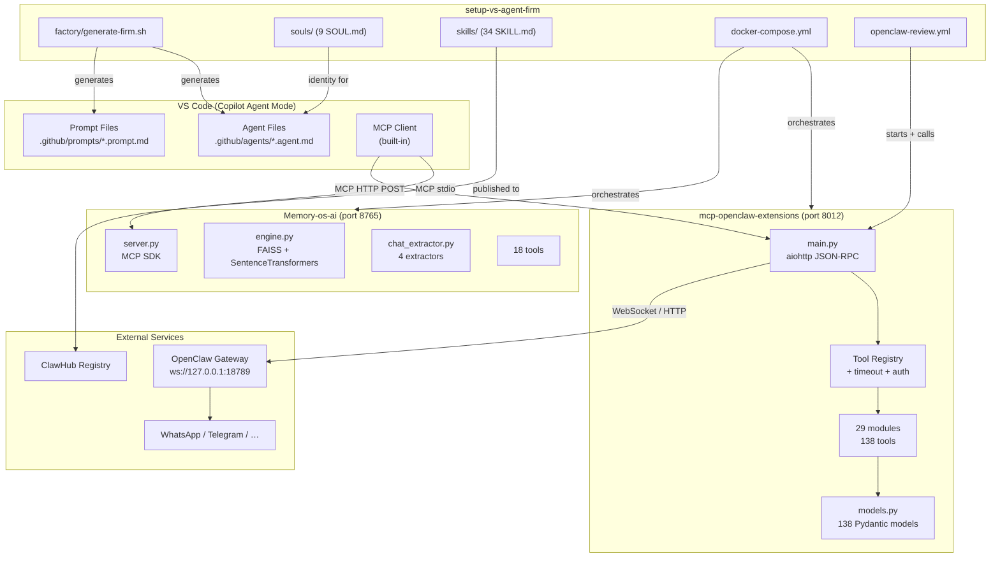
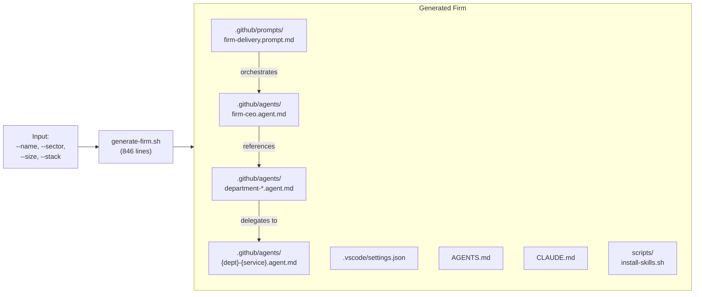
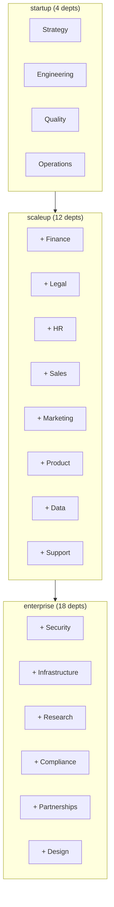
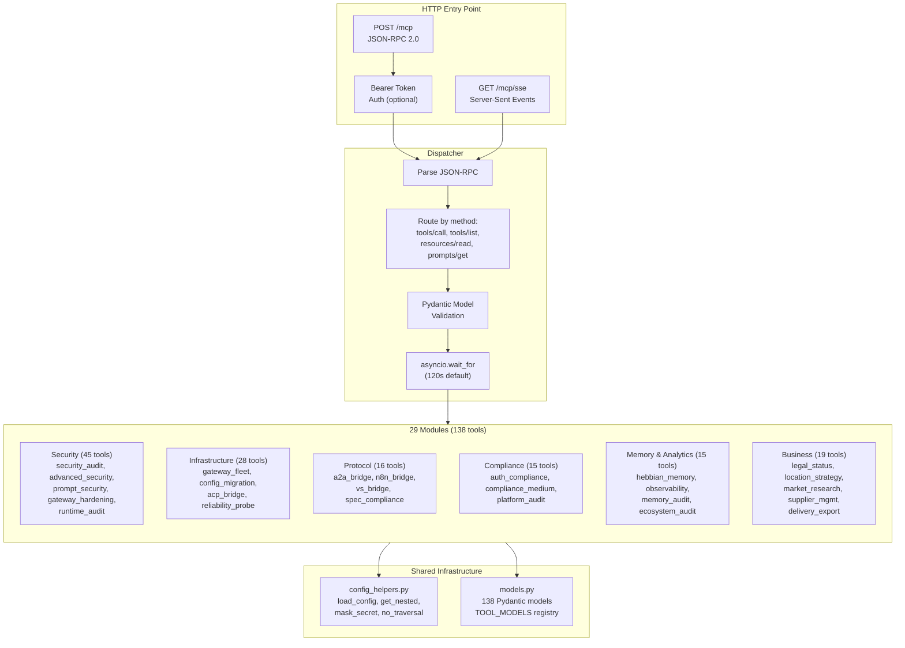
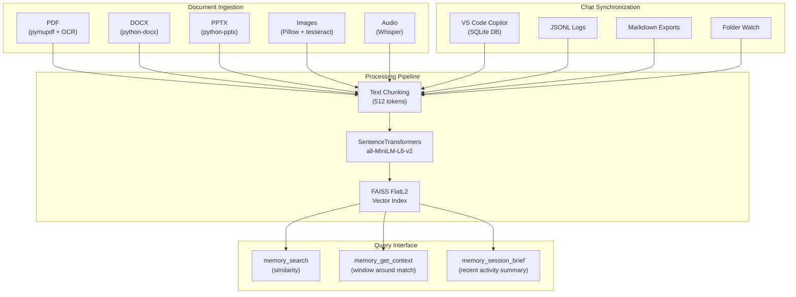
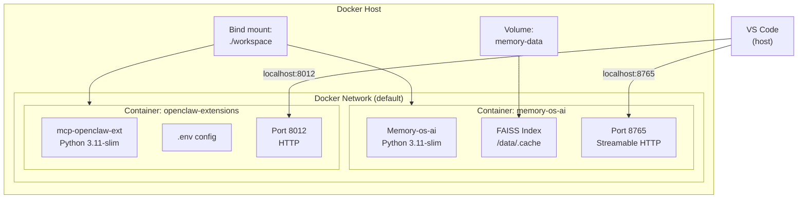
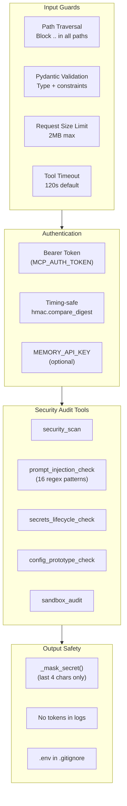
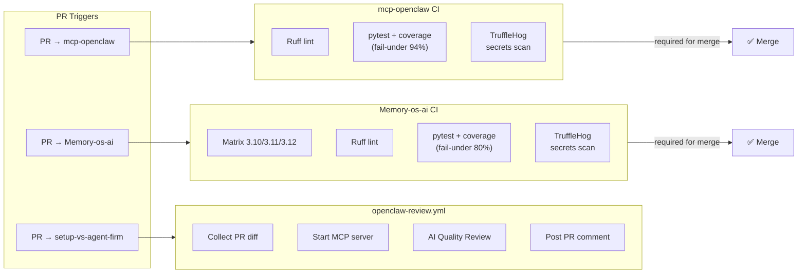
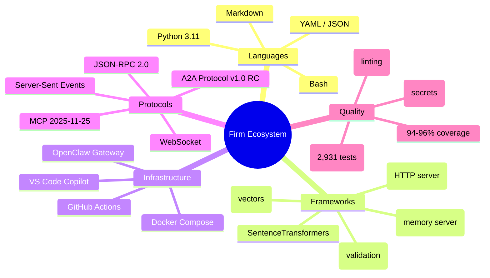

# Architecture

> System architecture of the Firm AI Agent ecosystem.

⚠️ Contenu généré par IA — validation humaine requise avant utilisation.

---

## High-Level Overview

The ecosystem follows a **hub-and-spoke** architecture where VS Code acts as the hub,
connecting to two MCP servers (spokes) that each have a distinct responsibility.



---

## Repository Boundaries

Each repository owns a specific layer of the stack:

```mermaid
graph LR
    subgraph Layer1["Layer 1: Generation & Configuration"]
        direction TB
        A1["generate-firm.sh"]
        A2["SOUL.md × 9"]
        A3["SKILL.md × 34"]
        A4["docker-compose.yml"]
        A5["mcp-config-unified.json"]
    end

    subgraph Layer2["Layer 2: Tool Execution"]
        direction TB
        B1["138 MCP tools"]
        B2["Pydantic validation"]
        B3["Bearer token auth"]
        B4["JSON-RPC 2.0 + SSE"]
        B5["Plugin: resources, prompts,<br/>elicitation, tasks"]
    end

    subgraph Layer3["Layer 3: Persistent Memory"]
        direction TB
        C1["FAISS vector index"]
        C2["Multi-format ingestion"]
        C3["Chat conversation sync"]
        C4["Cross-project linking"]
        C5["5 AI client bridges"]
    end

    Layer1 -->|"configures &<br/>deploys"| Layer2
    Layer1 -->|"configures &<br/>deploys"| Layer3
    Layer2 -.->|"complementary<br/>capabilities"| Layer3

    style Layer1 fill:#e1f5fe
    style Layer2 fill:#fff3e0
    style Layer3 fill:#e8f5e9
```



| Layer | Repository | Responsibility |
|-------|-----------|----------------|
| **Layer 1**: Generation | `setup-vs-agent-firm` | Create firms, define personas, publish skills, orchestrate deployment |
| **Layer 2**: Execution | `mcp-openclaw-extensions` | Run 138 audit/security/compliance/business tools via MCP |
| **Layer 3**: Memory | `Memory-os-ai` | Persist and retrieve semantic knowledge across sessions |

---

## Component Deep-Dives

### 1. Factory — Firm Generation Pipeline

The factory is a single Bash script that generates a complete VS Code agent
workspace from parameters:



**Sector customization** affects:
- Department structure (e.g., `legal` sector adds compliance-focused departments)
- Tool recommendations per agent
- SKILL.md installation list
- CONTRIBUTING.md templates

**Size determines department count:**



### 2. MCP Server — Tool Architecture

The `mcp-openclaw-extensions` server follows a modular architecture:



**Tool registration pattern** — each module exports a `TOOLS` list:

```python
# Example: security_audit.py
TOOLS = [
    {
        "name": "openclaw_security_scan",
        "title": "Security Scan",
        "description": "Scan OpenClaw config for SQL injection...",
        "inputSchema": { ... },
        "annotations": {"audience": ["operator"], "readOnlyHint": True},
    },
    # ... more tools
]

async def handle_openclaw_security_scan(params: dict) -> dict:
    validated = SecurityScanInput(**params)  # Pydantic validation
    # ... implementation
    return {"ok": True, "findings": [...], "severity": "clean"}
```

### 3. Memory Engine — FAISS Pipeline



---

## Deployment Architecture

### Docker Compose

Both MCP servers run as containers orchestrated by `docker-compose.yml` in
`setup-vs-agent-firm`:



### VS Code MCP Configuration

The `mcp-config-unified.json` connects both servers:

```json
{
  "servers": {
    "memory-os-ai": {
      "type": "stdio",
      "command": "memory-os-ai"
    },
    "openclaw-extensions": {
      "type": "http",
      "url": "http://127.0.0.1:8012/mcp"
    }
  }
}
```

When running locally (not Docker), Memory-os-ai uses **stdio** transport
(direct process communication), while openclaw-extensions always uses **HTTP**.

---

## Security Architecture



**Key security patterns:**
- **`_no_traversal(path)`**: Blocks `..` in every file path parameter (via `ConfigPathInput` base class)
- **16 compiled regex patterns** for prompt injection detection (CRITICAL: override/ChatML, HIGH: DAN/jailbreak, MEDIUM: base64/exfiltration)
- **SSRF protection**: localhost/127.0.0.1/0.0.0.0/::1 blocked in A2A bridge
- **Advisory file locks**: `fcntl.LOCK_EX | LOCK_NB` for workspace locking

---

## CI/CD Architecture



**Branch protection** is enforced on all 3 repositories:
- Force push: blocked
- Branch delete: blocked
- Required checks: `test` (mcp-openclaw), `test (3.11)` (Memory-os-ai)
- Admin enforcement: enabled

---

## Technology Stack Summary


