# Data Flow

> Request lifecycle, data flow patterns, and sequence diagrams for the Firm ecosystem.

⚠️ Contenu généré par IA — validation humaine requise avant utilisation.

---

## 1. Tool Call Lifecycle

When a VS Code Copilot agent invokes an MCP tool, the request flows through
multiple layers of validation and processing:

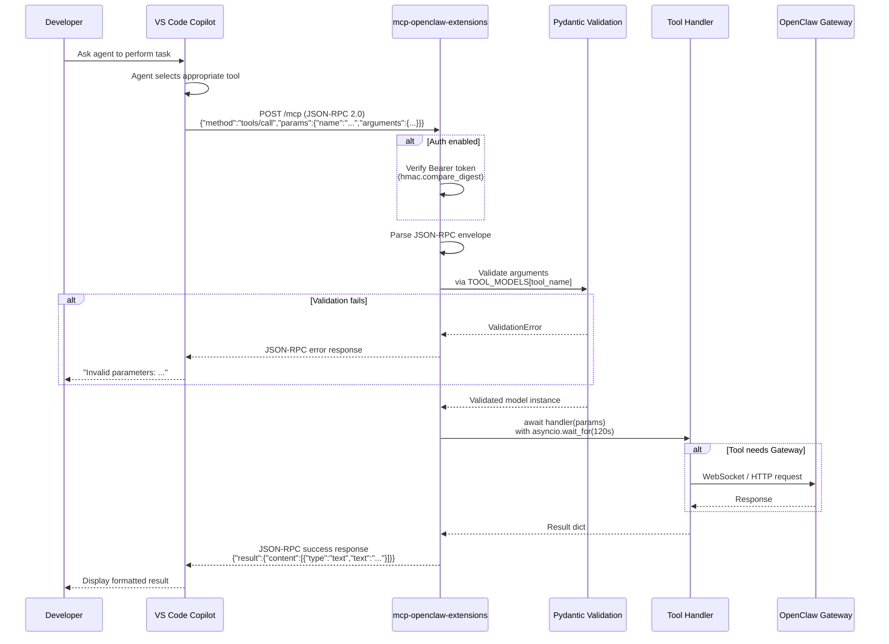

### Error Handling

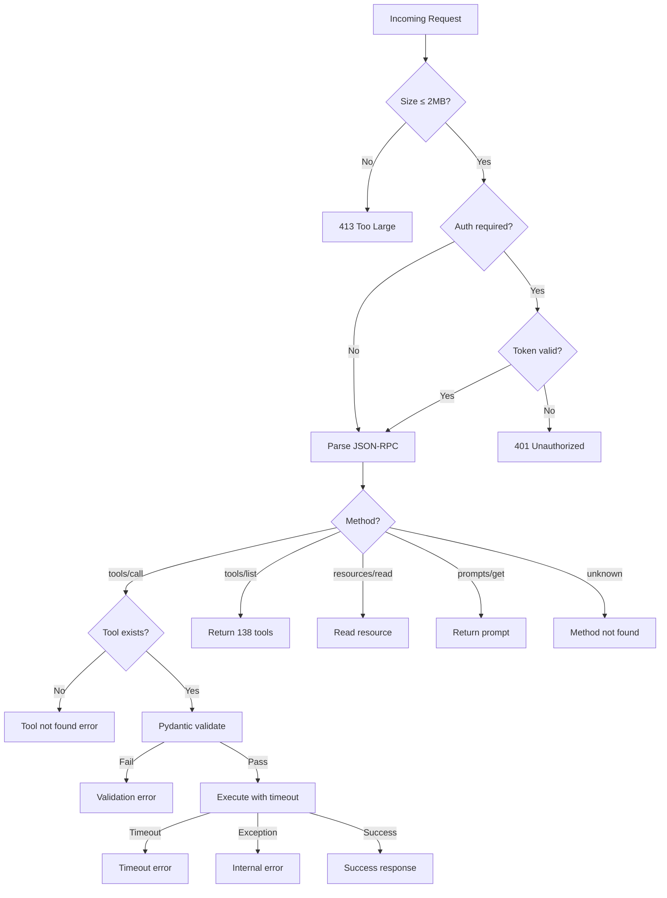

---

## 2. Memory Ingestion Flow

When a document is ingested into Memory-os-ai, it passes through a processing
pipeline:

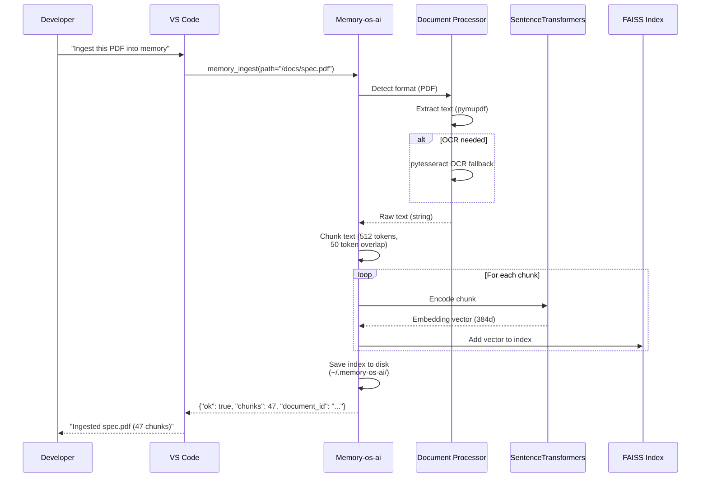

### Supported Formats

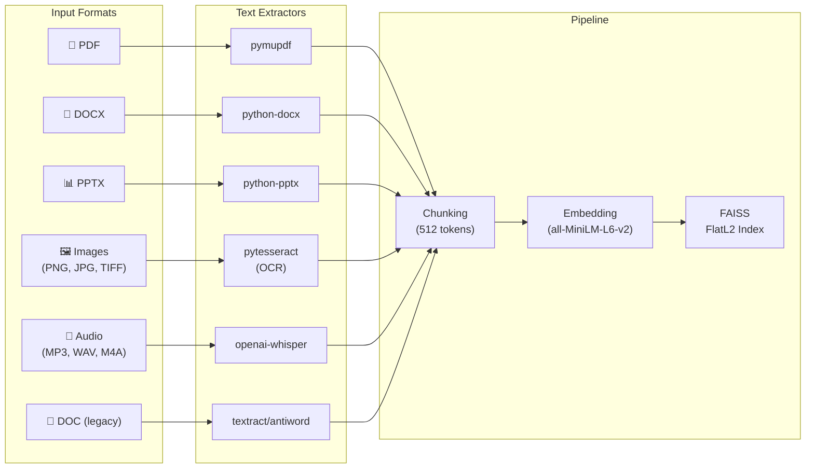

---

## 3. Chat Synchronization Flow

Memory-os-ai can automatically extract and index conversations from multiple
AI clients:

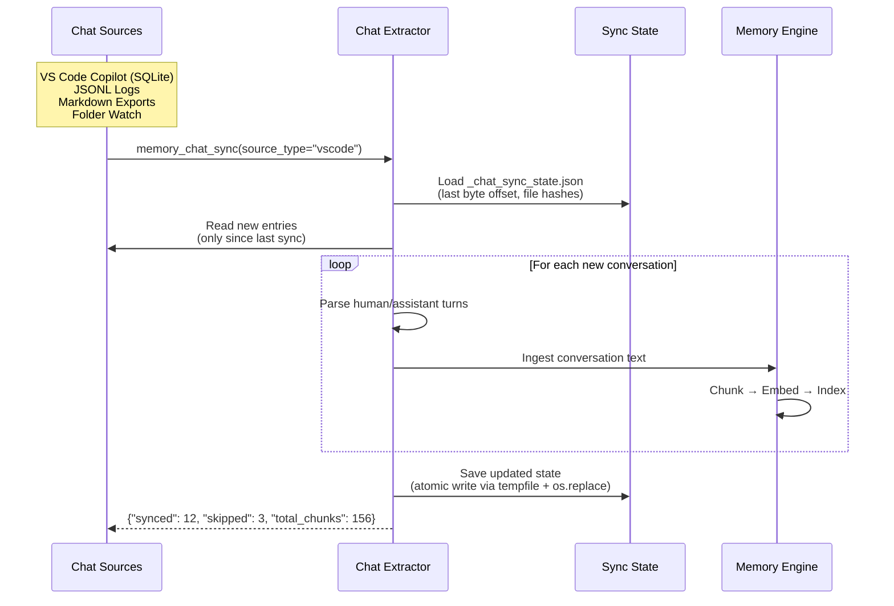

### Chat Source Paths

| Source | Location | Format |
|--------|----------|--------|
| VS Code Copilot | `~/Library/Application Support/Code/User/globalStorage/github.copilot-chat/` | SQLite |
| Claude Code | `.claude/` or `CLAUDE.md` | JSONL / Markdown |
| ChatGPT | Export folder | JSON |
| Generic | Any folder | Markdown, JSONL, text |

---

## 4. Firm Generation Flow

When the factory generates a new firm, it produces a complete VS Code workspace:

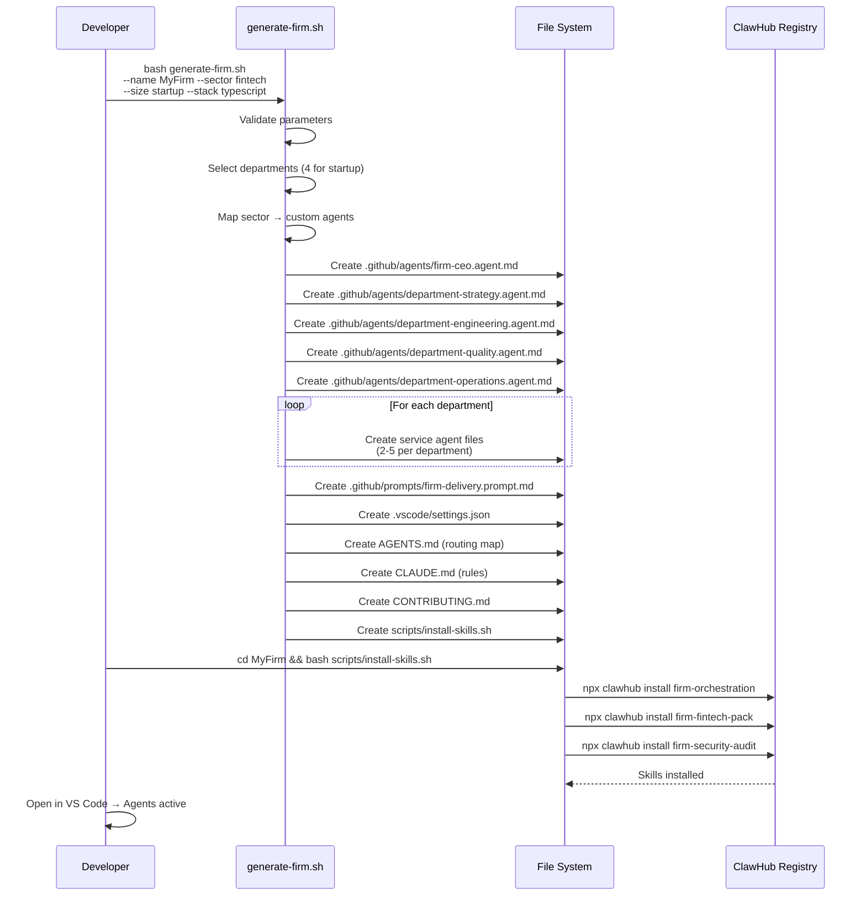

---

## 5. Security Audit Flow

A typical security audit uses multiple tools in sequence:

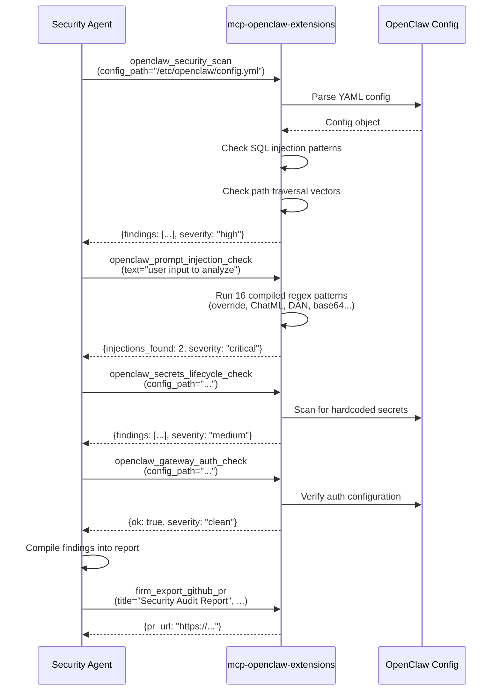

---

## 6. A2A Protocol Flow

The A2A (Agent-to-Agent) bridge enables inter-agent communication following
the A2A Protocol RC v1.0:

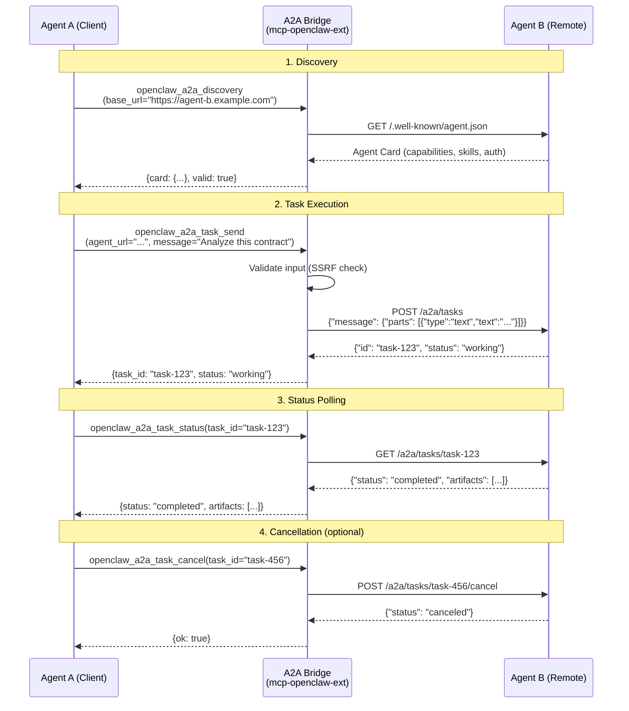

---

## 7. CI/CD — PR Review Flow

The AI-powered PR review in `openclaw-review.yml`:

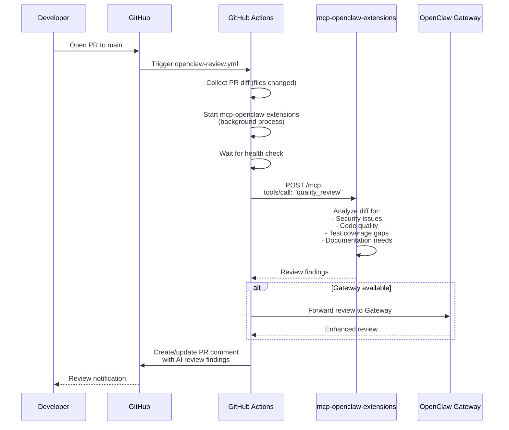

---

## 8. Cross-Project Memory Linking

Memory-os-ai supports linking memories across multiple projects:

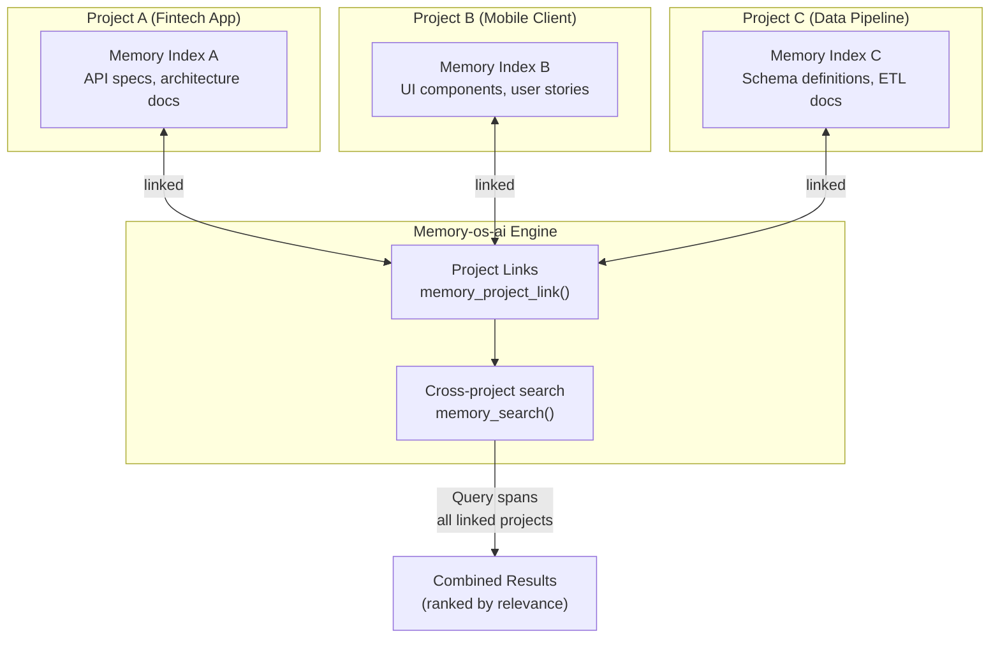

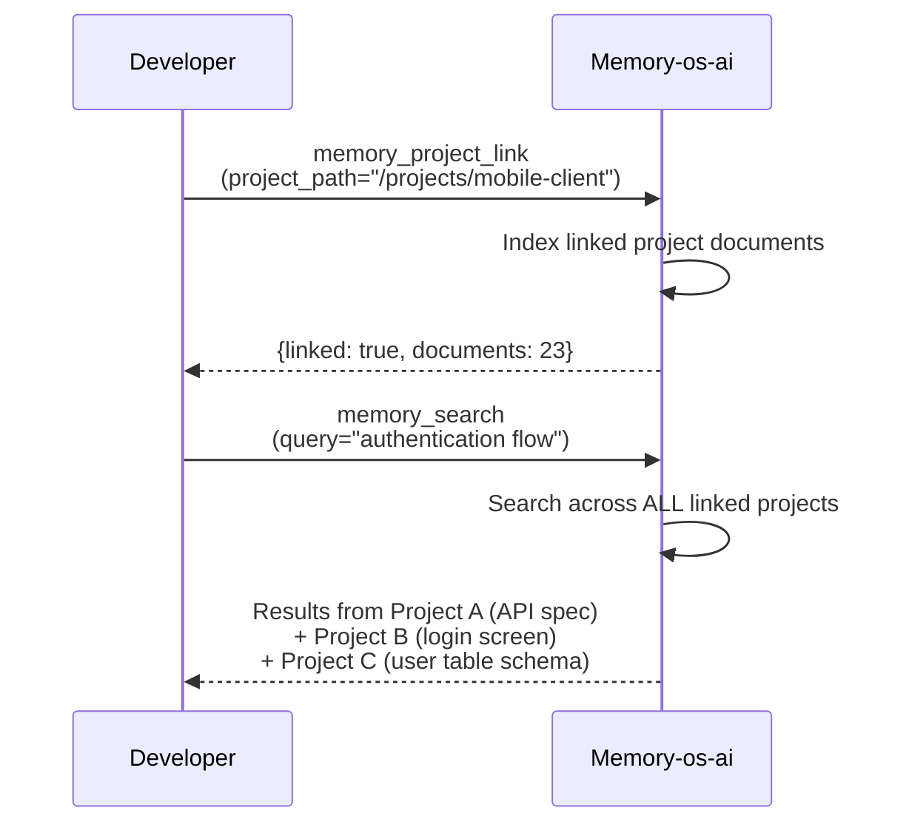

---

## 9. Hebbian Memory — Adaptive Learning

The Hebbian memory module in `mcp-openclaw-extensions` implements adaptive
weight adjustment for tool co-activation patterns:

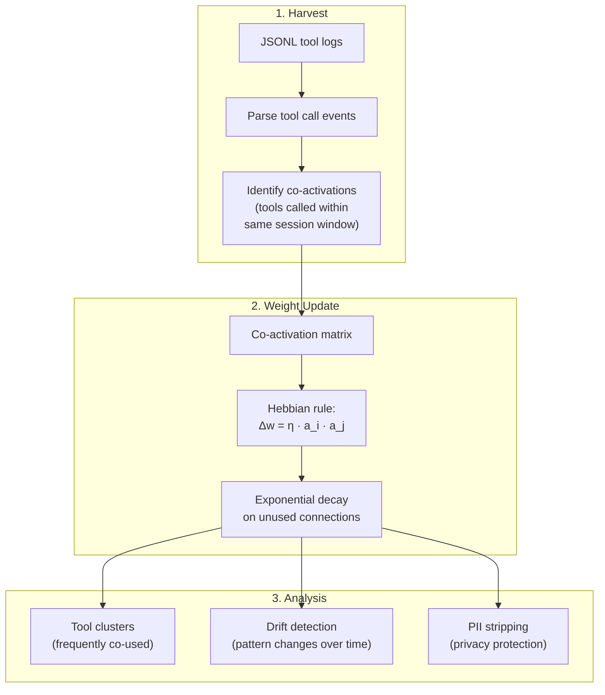
